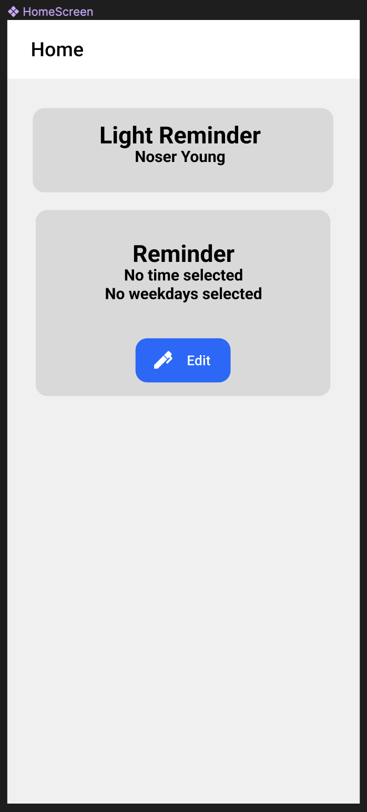

# Schriftliche Dokumente
## 1.1	Anforderungen
Im Dokumentationsteil Anforderungen ist Aufgabenstellung, die funktionalen und nicht-funktionalen Anforderungen zu finden. Um die Ansprüche an das Programm klar aufzuzeigen sind User-Stories zu verwenden. 
  
| A | Erinnerung einstellen | 1 |
 ----------------------------------- 
 Ich als: User,  
 möchte: Eine Erinnerung einstellen,  
 um: mich daran zu erinnern, das Licht auszumachen,  
 ----------------------------------- 
 Die User Story ist fertig, wenn:
 - [ ] Mercury
 - [x] Venus
 ----------------------------------- 

## 1.2	Architektur / Design
Die Applikation sollte zwei Seiten umfassen. 
Die erste Seite besteht aus zwei Karten. Auf der oberen steht der Name des Unternehmens und der Name der Anwendung in schwarzer Schrift auf grauem Hintergrund.  
 

Die untere Karte zeigt an, wie die aktuelle Erinnerung eingestellt ist. Es ist ein schwarzer Text auf grauem Hintergrund.  
  

 
## 1.3	Technischer Bericht
Die App wurde mit TS erstellt, wobei die Expo als Plattform für den Start der App dient. Wir verwenden die React Native Paper-Bibliothek für Material-Design-Komponenten und nutzen npm als Paketmanager. 
### 1.3.1	Testing
Zum Testing gehören Test-Cases, welche auf den User-Stories basieren. Die erstellten Test-Cases werden im Anschluss an die Realisierung geprüft. Das Ergebnis wird dabei im Testprotokoll festgehalten.
Test Protocol
TestCaseId	Component	Priority	Description/
Test Summary	Pre-requisites	Test Steps	Expected Result	Actual Result	Status	Test Executed By
GoogleSearch_1	Search_Bar_Module	P0	Verify that when a user writes a search term and presses enter, search results should be displayed	Browser is launched	1. Write the url - http://google.com in the browser's URL bar and press enter.	Search results related to 'apple' should be displayed	Search results with 'apple' keyword are displayed	Pass	TesterK
					2. Once google.com is launched, write the search term - "Apple" in the google search bar.				
					3. Press enter.				
Abbildung 2 Beispiel Testprotokoll

Der erwartete Umfang der Testabdeckung beträgt ein Happy-Path pro Feature und 2 Error-Paths (gesamthaft).

## 1.5	Code Dokumentation
Neben den Dokumenten soll im TSDocs im Code verwendet werden. TSDocs ist für TypeScript das, was JavaDocs für Java ist. Es beschreibt die Funktionalitäten des Codes und lässt sich mit zusätzlichen Tools extrahieren und zu einer Dokumentation zusammengefügt. TSDocs muss für die wichtigsten Funktionen vorhanden sein. 