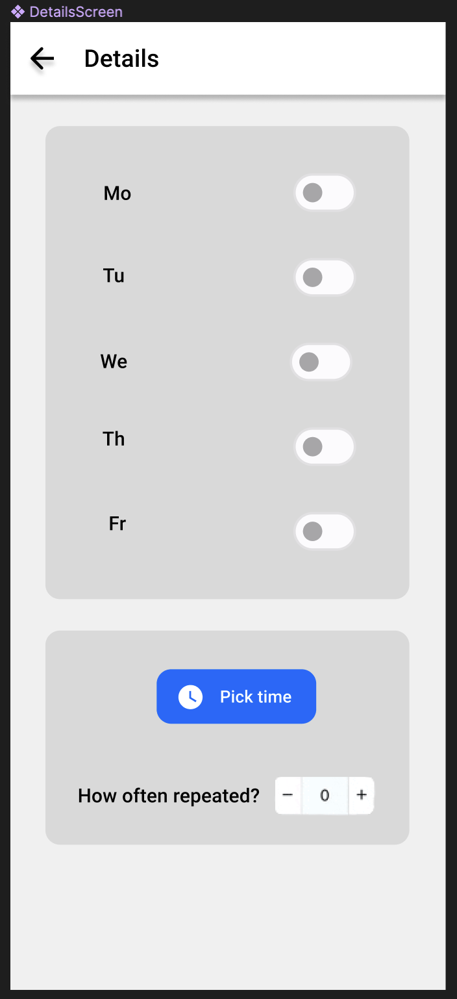

# Schriftliche Dokumente
## 1.1	Anforderungen
In den Räumlichkeiten der Noser Young AG in Altstetten existieren neben der Deckenbeleuchtung diverse lokale Leuchten, verteilt über die Arbeitsplätze der Lernenden und der Mitarbeitenden.
Diese Leuchten werden manuell bedient und so kommt es hin und wieder vor, dass diese Leuchten beim Verlassen der Räumlichkeiten nicht ausgeschaltet werden.
Um dies zu vermindern, soll eine mobile Applikation realisiert werden, welche bei einer bestimmten Uhrzeit eine konfigurierbare Erinnerung zum Ausschalten der Leuchten bietet.

### Funktionelle Anforderungen
Als Benutzer kann ich die Uhrzeit angeben, zu der die Erinnerung eintreffen soll
Als Benutzer kann ich die Wochentage angeben, an denen ich erinnert werden möchte
Als Benutzer kann ich festlegen, wie oft die Nachricht wiederholt werden soll.

### Nicht-funktionale Anforderungen
Als Benutzer finde ich die Benutzeroberfläche ansprechend
Als Benutzer kann ich mich auf den Seiten zurechtfinden

### 1.1.2 Ziele
 - [x] Der Benutzer sollte sehen können, ob eine Erinnerung eingestellt ist oder nicht. 
 - [x] Der Benutzer sollte die Möglichkeit haben, eine Zeit für eine Erinnerung festzulegen.
 - [x] Der Benutzer sollte die Wochentage auswählen können, an denen die Erinnerung eingestellt ist.
 - [x] Der Benutzer sollte wählen können, wie oft die Erinnerung wiederholt werden soll.
 - [ ] Der Benutzer sollte eine Benachrichtigung auf seinem Handy erhalten. 
  
| A | Erinnerung einstellen | 1 |
 ----------------------------------- 
 
 Ich als: User, <br>
 möchte: Eine Erinnerung einstellen, <br>
 um: mich daran zu erinnern, das Licht auszumachen, <br>

 ----------------------------------- 

 Die User Story ist fertig, wenn:
 - [ ] Der Benutzer hat die aktuelle Erinnerung gesehen.
 - [ ] Der Benutzer hat die aktuelle Erinnerung geändert.
 - [ ] Der Benutzer hat die neu geänderte Erinnerung gesehen. 
 ----------------------------------- 


## 1.2	Architektur / Design
Die Applikation sollte zwei Seiten umfassen. 
Die erste Seite besteht aus zwei Karten. Auf der oberen steht der Name des Unternehmens und der Name der Anwendung in schwarzer Schrift auf grauem Hintergrund. Die untere Karte zeigt an, wie die aktuelle Erinnerung eingestellt ist. Es ist ein schwarzer Text auf grauem Hintergrund. Ausserdem gibt es eine blaue Schaltfläche zum Bearbeiten, die zur zweiten Seite führt. 
<br>

Die zweite Seite besteht aus 5 Schaltern, die für die 5 Wochentage stehen, einer Schaltfläche, die die Zeitauswahl öffnet, und einem Wiederholungszähler. 
<br> 

 
[Figma Link](https://www.figma.com/file/GjetGNBuKabH9ujdrePub6/Light-Reminder?node-id=0-1&t=rDZi3L1KxI49qXCF-0)
## 1.3	Technischer Bericht
Die App wurde mit TS erstellt, wobei die Expo als Plattform für den Start der App dient. Wir verwenden die React Native Paper-Library für Material-Design-Komponenten und nutzen npm als Paketmanager. 

### Initialization
Install all required dependencies and or dev-dependencies

```bash
npm install
```

<br>

Run on your desired device/platform

<details>
  <summary>All devices/platforms</summary>
  
  ```bash
  npm start
  ```
</details>

<details>
  <summary>Android</summary>
  
  ```bash
  npm run android
  ```
</details>

<details>
  <summary>iOS</summary>
  
  ```bash
  npm run ios
  ```
</details>

<details>
  <summary>Web</summary>
  
  ```bash
  npm run web
  ```
</details>

<br>

**NOTE**  
Please run the following command to format the code before comitting
```bash
npx prettier --write .
```
### 1.3.1	Testing
Zum Testing gehören Test-Cases, welche auf den User-Stories basieren. Die erstellten Test-Cases werden im Anschluss an die Realisierung geprüft. Das Ergebnis wird dabei im Testprotokoll festgehalten.
Test Protocol
TestCaseId	Component	Priority	Description/
Test Summary	Pre-requisites	Test Steps	Expected Result	Actual Result	Status	Test Executed By
GoogleSearch_1	Search_Bar_Module	P0	Verify that when a user writes a search term and presses enter, search results should be displayed	Browser is launched	1. Write the url - http://google.com in the browser's URL bar and press enter.	Search results related to 'apple' should be displayed	Search results with 'apple' keyword are displayed	Pass	TesterK
					2. Once google.com is launched, write the search term - "Apple" in the google search bar.				
					3. Press enter.				
Abbildung 2 Beispiel Testprotokoll

Der erwartete Umfang der Testabdeckung beträgt ein Happy-Path pro Feature und 2 Error-Paths (gesamthaft).

## 1.5	Code Dokumentation
Neben den Dokumenten soll im TSDocs im Code verwendet werden. TSDocs ist für TypeScript das, was JavaDocs für Java ist. Es beschreibt die Funktionalitäten des Codes und lässt sich mit zusätzlichen Tools extrahieren und zu einer Dokumentation zusammengefügt. TSDocs muss für die wichtigsten Funktionen vorhanden sein. 